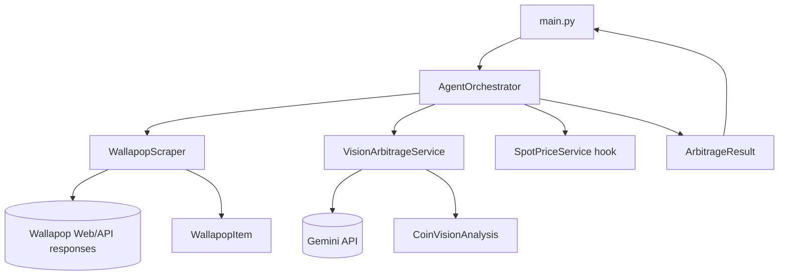

# WPOP Arbitrage Bot

Bot de exploración y análisis de anuncios de monedas de plata en Wallapop para detectar posibles oportunidades de arbitraje.

El proyecto combina scraping web, visión con Gemini y reglas de valoración para estimar si un anuncio podría estar por debajo del valor teórico del metal.

## Tabla de contenidos

- [WPOP Arbitrage Bot](#wpop-arbitrage-bot)
  - [Tabla de contenidos](#tabla-de-contenidos)
  - [Qué hace el proyecto](#qué-hace-el-proyecto)
  - [Cómo funciona realmente](#cómo-funciona-realmente)
  - [Arquitectura](#arquitectura)
    - [Diagrama de componentes](#diagrama-de-componentes)
  - [Flujo de datos end-to-end](#flujo-de-datos-end-to-end)
  - [Requisitos](#requisitos)
  - [Instalación de Python](#instalación-de-python)
    - [Windows](#windows)
    - [macOS / Linux](#macos--linux)
  - [Instalación de componentes (opción A: pip)](#instalación-de-componentes-opción-a-pip)
    - [1) Crear y activar entorno virtual](#1-crear-y-activar-entorno-virtual)
    - [2) Instalar dependencias base](#2-instalar-dependencias-base)
    - [3) Instalar dependencias adicionales usadas por el código actual](#3-instalar-dependencias-adicionales-usadas-por-el-código-actual)
    - [4) Instalar binarios del navegador para Playwright](#4-instalar-binarios-del-navegador-para-playwright)
  - [Instalación de componentes (opción B: uv)](#instalación-de-componentes-opción-b-uv)
    - [1) Instalar uv](#1-instalar-uv)
    - [2) Sincronizar entorno del proyecto](#2-sincronizar-entorno-del-proyecto)
    - [3) Instalar binarios del navegador para Playwright](#3-instalar-binarios-del-navegador-para-playwright)
  - [Configuración](#configuración)
    - [Cómo obtener la API key de Google (Gemini)](#cómo-obtener-la-api-key-de-google-gemini)
    - [Variables de entorno](#variables-de-entorno)
  - [Ejecución](#ejecución)
  - [Salida esperada](#salida-esperada)
  - [Estructura del repositorio](#estructura-del-repositorio)
  - [Limitaciones actuales](#limitaciones-actuales)
  - [Roadmap sugerido](#roadmap-sugerido)
  - [Solución de problemas](#solución-de-problemas)
  - [Descargo de responsabilidad](#descargo-de-responsabilidad)

## Qué hace el proyecto

WPOP Arbitrage Bot realiza, de forma automatizada, las siguientes tareas:

1. Consulta Wallapop por palabra clave.
2. Captura resultados desde respuestas JSON/GraphQL internas del sitio.
3. Extrae título, precio, URL del anuncio e imágenes.
4. Envía imágenes a Gemini para inferir moneda detectada, peso y ley.
5. Calcula un valor de fundición estimado.
6. Calcula margen porcentual frente al precio del anuncio.
7. Marca cada item como posible oportunidad o no.

## Cómo funciona realmente

El bot está orientado a consola y hoy ejecuta un flujo síncrono de análisis por cada item:

- Query actual por defecto: `monedas+plata`.
- Filtro de precio por defecto en pipeline: 30 EUR.
- Precio de plata por gramo usado en cálculo: 0.85 EUR/g (valor fijo temporal).
- Regla actual de chollo: margen mayor de 15%.

Fórmulas usadas:

- `melt_value = peso_g * ley * precio_gramo_plata`
- `margen = ((melt_value - precio_item) / precio_item) * 100`

## Arquitectura

Arquitectura por capas (simple y extensible):

1. Capa de entrada y ejecución
	- `main.py`: punto de entrada, lanza el pipeline y renderiza resultados en terminal.
2. Capa de orquestación
	- `orchestrator.py`: coordina scraping, análisis visual y cálculo económico.
3. Capa de servicios
	- `services/scraper.py`: scraping en Wallapop con Playwright e interceptación de respuestas JSON.
	- `services/vision.py`: descarga de imágenes y análisis con Gemini.
	- `services/spot_price.py`: hook para precio spot de plata (preparado para integración real).
4. Capa de dominio
	- `models.py`: modelos tipados (`WallapopItem`, `CoinVisionAnalysis`, `ArbitrageResult`).
5. Capa de configuración
	- `config.py`: settings con `pydantic-settings` y carga de `.env`.

### Diagrama de componentes



## Flujo de datos end-to-end

1. `main.py` crea `AgentOrchestrator`.
2. `run_search_pipeline` consulta Wallapop a través de `WallapopScraper`.
3. El scraper navega con Chromium headless y escucha respuestas de red JSON.
4. Se construye una lista de `WallapopItem` deduplicada por `id`.
5. Para cada item, `VisionArbitrageService` prueba sus imágenes.
6. Si Gemini responde JSON válido, se genera `CoinVisionAnalysis`.
7. Orquestador calcula `melt_value`, `margen_chollo`, `es_chollo`.
8. Se empaqueta todo en `ArbitrageResult` y se imprime en consola.

## Requisitos

- Python 3.10 o superior (recomendado 3.11 o 3.12).
- Conexión a Internet.
- API key de Gemini (`GEMINI_API_KEY`).
- Chromium de Playwright instalado.

## Instalación de Python

### Windows

1. Descarga Python desde la web oficial:
	- https://www.python.org/downloads/
2. Durante la instalación, activa la opción:
	- `Add python.exe to PATH`
3. Verifica en terminal:

```powershell
python --version
```

### macOS / Linux

Verifica si ya tienes Python:

```bash
python3 --version
```

Si no está instalado, usa el gestor de paquetes de tu sistema y confirma versión 3.10+.

---

## Instalación de componentes (opción A: pip)

### 1) Crear y activar entorno virtual

Windows (PowerShell):

```powershell
python -m venv .venv
.\.venv\Scripts\Activate.ps1
```

macOS / Linux:

```bash
python3 -m venv .venv
source .venv/bin/activate
```

### 2) Instalar dependencias base

```bash
pip install -r requirements.txt
```

### 3) Instalar dependencias adicionales usadas por el código actual

`requirements.txt` no incluye todas las librerías presentes en la implementación actual. Instala también:

```bash
pip install playwright python-dotenv httpx google-generativeai
```

### 4) Instalar binarios del navegador para Playwright

```bash
playwright install chromium
```

En algunos sistemas Linux también puede requerirse:

```bash
playwright install-deps chromium
```

---

## Instalación de componentes (opción B: uv)

`uv` resuelve e instala dependencias desde `pyproject.toml` de forma rápida y reproducible.

### 1) Instalar uv

Documentación oficial:
- https://docs.astral.sh/uv/

### 2) Sincronizar entorno del proyecto

Desde la raíz del repositorio:

```bash
uv sync
```

### 3) Instalar binarios del navegador para Playwright

```bash
uv run playwright install chromium
```

En Linux, si hace falta:

```bash
uv run playwright install-deps chromium
```

---

## Configuración

### Cómo obtener la API key de Google (Gemini)

Si nunca has usado Google AI Studio, sigue estos pasos:

1. Entra en Google AI Studio:
	- https://aistudio.google.com/
2. Inicia sesión con tu cuenta de Google.
3. Abre la opción para claves API (normalmente "Get API key").
4. Crea una clave nueva en un proyecto nuevo o existente.
5. Copia la clave generada.
6. Guárdala en el archivo `.env` del proyecto como `GEMINI_API_KEY`.

Referencia oficial de Google Gemini API:
- https://ai.google.dev/gemini-api/docs/api-key
- https://ai.google.dev/gemini-api/docs/quickstart

### Variables de entorno

Crea un archivo `.env` en la raíz del proyecto:

```env
GEMINI_API_KEY=tu_api_key_aqui
TELEGRAM_BOT_TOKEN=
ENABLE_VISION_STAGE=True
DEFAULT_SILVER_MARGIN_THRESHOLD=0.15
```

Detalle de variables:

- `GEMINI_API_KEY`: obligatoria para análisis visual.
- `TELEGRAM_BOT_TOKEN`: preparada para integración de bot, no usada en el flujo actual de `main.py`.
- `ENABLE_VISION_STAGE`: flag de arquitectura, no aplicado todavía como interruptor efectivo en el pipeline actual.
- `DEFAULT_SILVER_MARGIN_THRESHOLD`: parámetro de configuración; actualmente el umbral efectivo está hardcodeado a 15% dentro del orquestador.

## Ejecución

Con entorno pip activado:

```bash
python main.py
```

Con uv:

```bash
uv run python main.py
```

## Salida esperada

Por cada anuncio analizado, el bot muestra en consola:

- Título y precio.
- URL del anuncio.
- Moneda detectada por visión (si aplica).
- Peso y ley estimados.
- Valor de fundición estimado.
- Margen estimado.
- Flag final de oportunidad (`SI` o `NO`).

## Estructura del repositorio

```text
.
├── config.py
├── main.py
├── models.py
├── orchestrator.py
├── pyproject.toml
├── requirements.txt
├── README.md
└── services/
	 ├── scraper.py
	 ├── spot_price.py
	 └── vision.py
```

## Limitaciones actuales

1. Dependencia de estructura interna de Wallapop: cambios en la web/API pueden romper extracción.
2. Estimación por visión: la identificación de moneda, peso y ley puede tener errores.
3. Precio spot temporal: se usa valor fijo (0.85 EUR/g), no feed de mercado en tiempo real.
4. Umbral de margen fijo en código: 15% hardcodeado en orquestador.
5. `requirements.txt` y `pyproject.toml` no están 100% alineados.
6. Falta de test suite automatizada para asegurar regresiones.

## Roadmap sugerido

1. Integrar precio spot real desde `SpotPriceService`.
2. Parametrizar query, `max_price` y umbral de margen por CLI o env.
3. Unificar dependencias entre `requirements.txt` y `pyproject.toml`.
4. Añadir logging estructurado y manejo de errores por tipo.
5. Implementar tests unitarios e integración (scraper/vision/orquestador).
6. Añadir persistencia de resultados (CSV/SQLite/PostgreSQL).
7. Activar flujo Telegram para alertas en tiempo real.

## Solución de problemas

- Error de Playwright/navegador faltante:
  - Ejecuta `playwright install chromium` o `uv run playwright install chromium`.
- Error de clave Gemini:
  - Revisa que `GEMINI_API_KEY` esté definida en `.env`.
- Error de permisos en PowerShell al activar `.venv`:
  - Ejecuta `Set-ExecutionPolicy -Scope Process -ExecutionPolicy RemoteSigned`.
- Dependencias no encontradas:
  - Verifica que el entorno virtual esté activo y reinstala dependencias.
- Respuestas vacías de visión:
  - Comprueba conectividad, cuota de API y validez de la imagen descargada.

## Descargo de responsabilidad

Este proyecto se ofrece con fines educativos y de investigación técnica.

- No garantiza rentabilidad ni precisión financiera.
- Debes verificar manualmente autenticidad, estado real de la pieza y costes asociados antes de comprar.
- Respeta siempre los términos de uso de las plataformas y la normativa aplicable.